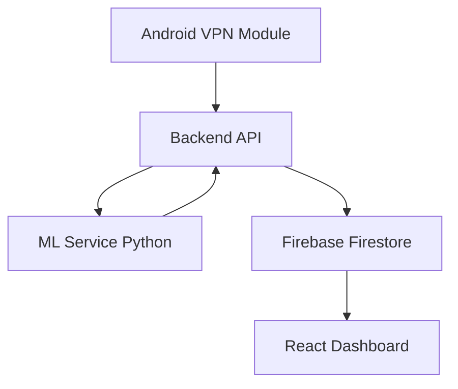

 <div align="center">

# VectraGuard Dashboard - Intrusion Detection System


### v1.0.0 • Developed by **@codinglavinia**
<div align="center">
<a href="https://github.com/sponsors/codinglavinia">
  
</a>

</div>
</div>


---
🇷🇴 VectraGuard este o aplicație mobile și web pentru monitorizarea securității rețelei, combinând detecția bazată pe regulile de Machine Learning pentru alerte.
Acest tablou de bord reprezintă interfața centrală a unui sistem de detectare a intruziunilor (IDS) conceput pentru a monitoriza traficul de rețea în timp real.

Obiectivul său este: detectarea atacurilor malitioase prin intermediul regulilor și a modelelor M.L cât și generarea de alerte automate pentru analiza pachetelor .

Acest sistem oferă vizibilitate completă asupra evenimentelor de rețea, corelarea atacurilor și analiza criminalistică a pachetelor detectate de VectraGuard.


🇬🇧 VectraGuard is a multiplatform mobile and web cybersecurity application. It integrates a native Android network sniffer implemented in Java (VpnService) with a React-based interface, combining rule-based detection in Python and Machine Learning techniques for traffic analysis, real-time monitoring and alert persistence.

🇩🇪 VectraGuard ist eine Mobile- und Web-App zur Überwachung der Netzwerksicherheit, die regelbasierte Erkennung und Machine Learning für Echtzeitwarnungen kombiniert

🇪🇸 VectraGuard es una aplicación multiplataforma( móvil+ web) para la monitorización de seguridad de red, combinando detección basada en reglas de Machine Learning para alertas en tiempo real. 
Este dashboad es la interfaz central de un Sistema de Detección de Intrusiones (IDS) diseñado para monitorizar tráfico de red en tiempo real.

Su objetivo es : detectar patrones maliciosos mediante reglas y modelos de Machine Learning y generar alertas automáticas para análisis de seguridad.

Proporciona visibilidad completa sobre eventos de red, correlación de ataques y análisis forense de paquetes detectados por el ecosistema VectraGuard.

---

## 🚀 Características principales:

* 🔴 **Detección en tiempo real** de eventos de red y alertas IDS
* 🧠 **Clasificación inteligente de ataques** (DDoS, SQLi, Brute Force, Port Scanning, etc.)
* 📊 **Visualización avanzada** de métricas y actividad sospechosa
* 🔍 **Analisis forense de red** (IPs, protocolos, flags TCP, TTL, payload metadata)
* 📄 **Generación de reportes PDF** para auditoría y análisis post-incidentes
* ⚙️ **Gestión de reglas IDS** y políticas de detección
* 🔔 **Sistema de alertas centralizado en tiempo real (Firebase Firestore)**

---

## 🏗️ Arquitectura del sistema :

VectraGuard está diseñado como un **monorepo modular multiplataforma**:

```
VectraGuard Multiplatform System

├── packages/
│   ├── shared/                  # Tipos, hooks y utilidades compartidas (React Native + Web)
│   └── web/                     # Dashboard web (React + Vite)
│
├── apps/
│   ├── mobile/                  # App móvil (React Native + Expo)
│   └── backend/                 # API backend (Node.js + Express)
│
├── services/
│   └── ml-service/              # Servicio de Machine Learning (Python)
│
├── android/
│   └── native modules          # VPN Service + Packet Sniffer (Java)
│
└── package.json                # Orquestador del monorepo
```

---

## 🧠 Stack Tecnológico utilizado :

**Frontend:** React.js + Vite + TypeScript

**Backend:** Node.js + Express

**Base de datos:** Firebase Firestore (real-time alerts)

**ML Engine:** Python (scikit-learn / modelos personalizados)

**Mobile:** React Native + Expo

**Android Nativo:** Java (VpnService + Packet Capture)

**Reporting:** Generación de PDFs automatizados

---

## ⚙️ Instalación y ejecución:

### 📌 Requisitos:

* Node.js ≥ 18 (recomendado LTS)
* npm o yarn
* Android SDK (si se usa módulo nativo)
* Firebase project configurado (opcional para producción)

---

### 📥 Clonar repositorio:

```bash
git clone https://github.com/codinglavinia/VectraGuard-App
cd VectraGuard-App
```

---

### 📦 Instalar dependencias:

```bash
npm install
# o
yarn install
```

---

### 🔐 Variables de entorno:

```bash
cp .env.example .env.local
```

Configurar:

* Firebase credentials
* API endpoints
* ML service URL

---

### ▶️ Ejecutar en desarrollo :

```bash
npm run dev
```

Aplicación disponible en:
`http://localhost:3000` (o puerto definido en configuración)

---

## 🧪 Módulo de Machine Learning :

```bash
npm run genkit:dev
```

---

## 👤 Flujo de Usuario:

**Registro:** creación de usuario con asignación automática de rol

**Login:** autenticación segura

**Dashboard:** visualización de alertas y métricas IDS

**Perfil:** gestión de datos personales

**Notificaciones:** alertas configurables por rol (admin/user)

---

## 🗄️ Base de Datos:

Actualmente esta en Firebase.

Opciones compatibles:MySQL

---

## 🚀 Despliegue

### Vercel (recomendado)

1. Push a GitHub
2. Importar proyecto en Vercel
3. Configurar variables de entorno
4. Deploy automático

---

### Hosting en Firebase 

```bash
npm install -g firebase-tools
firebase login
firebase init hosting
firebase deploy
```

---

VectraGuard integra detección híbrida basada en:

* 🔐 Reglas IDS clásicas
* 🤖 Machine Learning
* 📡 Captura nativa Android
* ⚡ Streaming en tiempo real

---

<div align="center">

##  VectraGuard - Security Architecture

</div>

---

## 📚 Datasets de Entrenamiento y Evaluación (ML):

El componente de Machine Learning de VectraGuard ha sido entrenado y validado utilizando datasets estándar de investigación en ciberseguridad:

* 🧪 **UNSW-NB15 (UNSW15)**: Dataset moderno de tráfico de red realista que incluye ataques contemporáneos (exploits, fuzzers, backdoors, DoS, etc.) y tráfico benigno.
* 🧪 **KDD Cup 99 (KDD99)**: Dataset clásico ampliamente utilizado en IDS para la detección de intrusiones basadas en firmas y anomalías.

Estos datasets permiten cubrir tanto:

* 🔄 Escenarios modernos (UNSW-NB15)
* 📜 Escenarios clásicos de benchmark (KDD99)

El uso combinado mejora la generalización del modelo  frente a distintos tipos de tráfico y técnicas de ataque.

---

## 🧠 Threat Model (Modelo de Amenazas):

VectraGuard ha sido diseñado considerando un entorno de red hostil donde un atacante puede:

* 📡 Inyectar tráfico malicioso (DDoS, spoofing, scanning)
* 🧬 Evadir detección mediante fragmentación de paquetes
* 🕵️ Intentar falsificación de identidad (IP spoofing)
* 💥 Explorar vulnerabilidades de servicios expuestos

### Superficie de ataque :

* API Backend (Node.js/Express)
* Canal de ingestión de alertas (Firestore)
* Servicio ML (Python)
* Módulo Android VPN (Packet capture layer)

### Mitigaciones implementadas:

* Validación estricta de inputs en backend
* Separación de servicios (arquitectura modular)
* Control de acceso basado en roles (RBAC)
* Sanitización de datos antes de persistencia

---

## 🔐 Seguridad del Sistema:

* 🔑 Autenticación basada en tokens (JWT o equivalente)
* 🔒 Hashing de contraseñas (bcrypt)
* 🧾 Validación de esquemas en API requests
* 🚫 Protección contra inyección (SQL/NoSQL injection)
* 📡 Comunicación segura (HTTPS en producción)

---

## 🧪 Testing :

### Caja negra (Black-box testing) :

* Validación de login con credenciales válidas e inválidas
* Pruebas de flujo de usuario (registro → dashboard → alertas)
* Simulación de ataques desde interfaz de red

### Caja blanca (White-box testing) :

* Testing de funciones de parsing de paquetes
* Validación de reglas IDS internas
* Cobertura de lógica de clasificación ML
* Tests unitarios en servicios backend

---

## 📊 Métricas de Evaluación IDS:

El sistema puede evaluarse mediante métricas estándar de ciberseguridad:

* 🎯 **True Positive Rate (TPR / Recall)**
* ⚠️ **False Positive Rate (FPR)**
* 📉 **Precision del modelo de detección**
* 📊 **F1-Score para balance de clasificación**
* ⏱️ Latencia de detección en tiempo real

---

## 📈 Diagrama de Arquitectura :



---

## 🧩 Justificación del diseño distribuido:
VectraGuard adopta una arquitectura distribuida basada en microservicios ligeros con separación clara de responsabilidades:

* Captura (Android)
* Procesamiento (Backend)
* Inteligencia (ML Service)
* Visualización (Web Dashboard)

Este enfoque permite escalabilidad horizontal, mantenimiento modular y reducción de acoplamiento entre componentes críticos del sistema IDS.

---

## 🏁 Nivel de contribución demonstrado:

* 🔬 Investigación aplicada en detección de intrusiones híbridas
* ⚙️ Integración de tecnologías reales de producción
* 🧠 Aplicación de ML en ciberseguridad en tiempo real
* 📡 Arquitectura multi-plataforma completa (mobile + web + backend)
